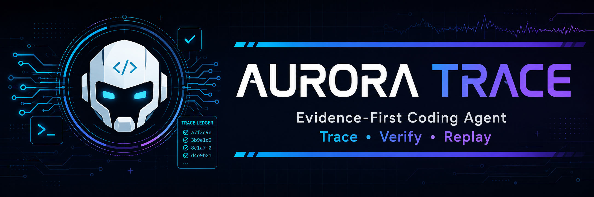

# AURORA TRACE

<p align="center">
  
</p>

<p align="center"><strong>Evidence-First Local Coding Agent</strong><br>Replayable, auditable execution for software-engineering tasks.</p>

<p align="center"><a href="README.md">简体中文</a> · <a href="README_EN.md">English</a></p>

<p align="center">
  
  
  
  
  
</p>

> 当前入口 / Current entry: `web/console.html`, served by `python aurora.py` at `http://127.0.0.1:8765`.

## 中文简介

AURORA TRACE 是一个面向软件工程任务的证据驱动型 Coding Agent 实验平台。它把每次运行组织成一条可解释、可验证、可追溯、可回放的闭环：

```text
模型决策 → 本地工具 → 真实结果 → 验证契约 → 证据记录 → 回放
```

项目不依赖 LangChain、LlamaIndex、OpenAI Agents SDK 或其他 Agent 框架。模型只负责提出下一步动作；本地执行器负责文件与命令操作；验收器负责判断任务是否真正完成。

## Highlights

- **Evidence Ledger** — 记录决策、工具调用、文件变化和测试结果。
- **Adaptive Acceptance Contract** — 为 Bug 修复、功能新增、重构和普通变更选择不同验收策略。
- **Replayable Run** — 独立 run workspace、Diff、事件流和运行历史。
- **Verified Apply** — 验收通过后检查原项目状态，再写回最小已验证补丁并保留备份。
- **Guarded Workspace** — 文件边界、命令白名单、审批和超时控制。
- **Mock Demo** — 无需 API Key 即可演示“复现失败 → 修改 → 复测 → 验收通过”。
- **OpenAI-compatible** — 支持 OpenAI 兼容网关和内置 Mock 模式。

## Quick Start

需要 Python 3.10 或更高版本；运行时仅使用 Python 标准库。

```powershell
cd aurora-trace
python aurora.py
```

打开 <http://127.0.0.1:8765>，选择内置 Todo 项目和 **Mock Demo**，点击 **开始受控运行 / Start Controlled Run**。

真实模型模式：

```powershell
$env:AURORA_MODE = "live"
$env:OPENAI_API_KEY = "your-key"
$env:OPENAI_BASE_URL = "https://api.openai.com/v1"
$env:AURORA_MODEL = "gpt-4o-mini"
python aurora.py
```

API Key 只从环境变量读取，不会写入仓库或运行记录。

## Demo Flow

默认演示修复 Todo 删除边界 Bug，并运行：

```powershell
python -m unittest discover -s tests -v
```

控制台会展示项目扫描、读取代码、形成基线、复现失败、应用补丁、重新测试、验收 Gate、证据时间线和 Replay。

## Architecture

```text
Browser Console → HTTP API → Agent Controller → Model Adapter
                                      ↓
                              Contract Gate + Tool Registry
                                      ↓
                       Isolated Workspace + Evidence Ledger
```

## Documentation

| 文档 | 内容 |
| --- | --- |
| [ARCHITECTURE.md](ARCHITECTURE.md) | 分层架构、事件结构和系统边界 |
| [EVALUATION.md](EVALUATION.md) | 可复现实验协议与验收策略 |
| [DESIGN.md](DESIGN.md) | AURORA TRACE 与基础 Coding Agent 的差异 |
| [DESIGN_DECISIONS.md](DESIGN_DECISIONS.md) | 工程决策与取舍 |
| [README_EN.md](README_EN.md) | English project overview |

## Project Layout

```text
aurora.py                 # HTTP 服务、Agent 循环、工具、契约和模型适配器
web/console.html          # Evidence Workbench 控制台
seed_project/             # 故意含 Bug 的 Todo 演示项目
tests/                    # 安全、执行和契约测试
assets/                   # README 视觉资源
```

## Scope and Safety

AURORA TRACE 是可复现的工程实验平台，不是生产级沙箱或通用多智能体调度器。不可信项目应在专用目录或低权限环境中运行。

## License

MIT
